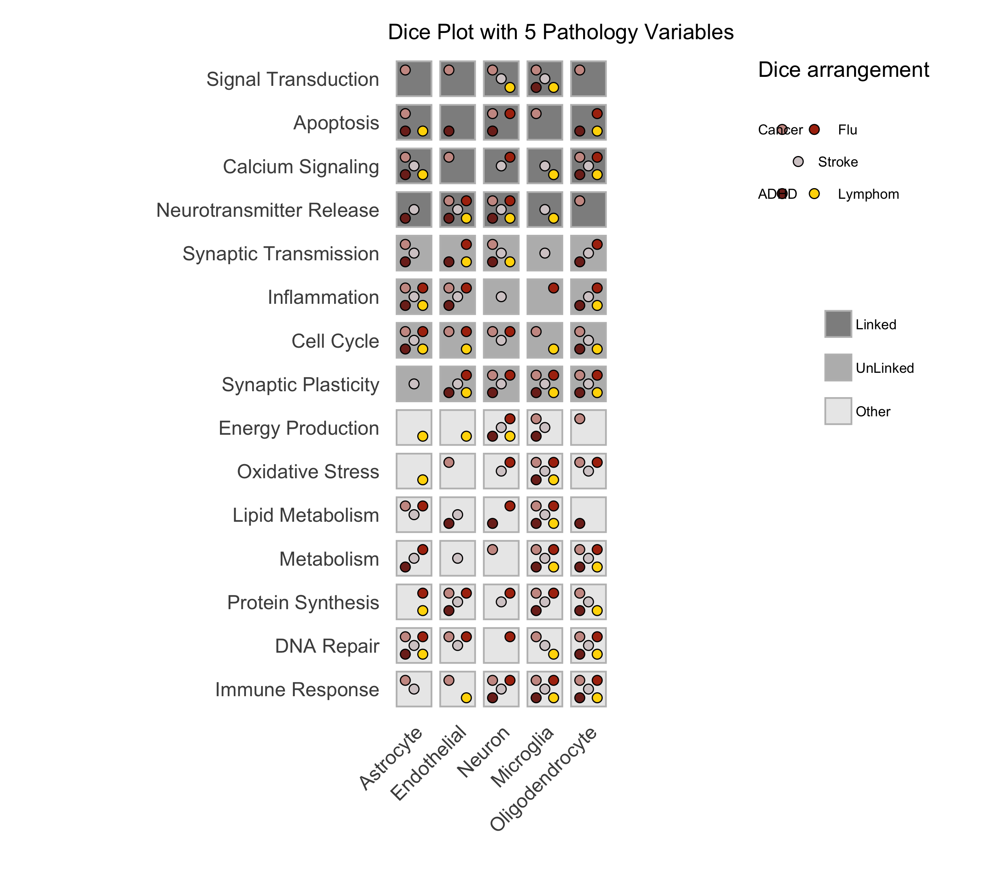

R - Diceplot
=======================

.. image:: https://www.r-pkg.org/badges/version/diceplot
    :target: https://CRAN.R-project.org/package=diceplot
    :alt: CRAN Status Badge

Requirements and installation
~~~~~~~~~~~~~~~~~~~~~~~~~~~~~
For installing the latest version of diceplot please clone the repository from github.
For installing the package you can use the following methods:

Direct installation from CRAN:

.. code-block:: r

    install.packages("diceplot")

You can install the latest version of ``DicePlot`` package directly from GitHub using the ``devtools`` package

.. warning::
    At the current stage the code might not be compatible with the CRAN release!
    please check the change-log in the github repository for detailed information

.. code-block:: r

   # Install devtools if you haven't already
   install.packages("devtools")
   # Install DicePlot from GitHub
   devtools::install_github("maflot/DicePlot/diceplot")

Install DicePlot from Files
---------------------------

Download the repository and run the following code to install the package:

.. code-block:: r

   install.packages("$path on your local machine$/DicePlot/diceplot", repos = NULL, type = "source")

Load the Package
----------------

After installation, load the ``DicePlot`` package into your R session:

.. code-block:: r

   library(diceplot)

Diceplot
~~~~~~~~

Example Usage
-------------

Here is a simple example of how to use the ``diceplot`` package using dummy data.
The example shows a dummy dataframe containing three hypothetical categorical variables: ``CellType``, ``Pathway``, and ``PathologyVariable``.
The ``Group`` variable is used to assign different colors to the pathways.

.. code-block:: r

   # Load necessary libraries
   library(diceplot)
   library(tidyr)
   library(data.table)
   library(ggplot2)
   library(dplyr)
   library(tibble)
   library(grid)
   library(cowplot)

   plot_path = "./"

   # Define the variables and their colors for 3 variables
   pathology_variables <- c("Stroke", "Cancer", "Flu")
   cat_c_colors <- c(
   "Stroke" = "#d5cccd",
   "Cancer" = "#cb9992",
   "Flu" = "#ad310f"
   )

   # Define cell types (cat_a)
   cell_types <- c("Neuron", "Astrocyte", "Microglia", "Oligodendrocyte", "Endothelial")

   # Define pathways (cat_b) and groups
   pathways <- c(
   "Apoptosis", "Inflammation", "Metabolism", "Signal Transduction", "Synaptic Transmission",
   "Cell Cycle", "DNA Repair", "Protein Synthesis", "Lipid Metabolism", "Neurotransmitter Release"
   )

   # Assign groups to pathways
   pathway_groups <- data.frame(
   Pathway = pathways,
   Group = c(
      "Linked", "UnLinked", "Other", "Linked", "UnLinked",
      "UnLinked", "Other", "Other", "Other", "Linked"
   ),
   stringsAsFactors = FALSE
   )

   # Define group colors
   group_colors <- c(
   "Linked" = "#333333",
   "UnLinked" = "#888888",
   "Other" = "#DDDDDD"
   )

   # Create dummy data
   set.seed(123)
   data <- expand.grid(CellType = cell_types, Pathway = pathways, stringsAsFactors = FALSE)

   # Assign random pathology variables to each combination
   data <- data %>%
   rowwise() %>%
   mutate(
      PathologyVariable = list(sample(pathology_variables, size = sample(1:3, 1)))
   ) %>%
   unnest(cols = c(PathologyVariable))

   # Merge the group assignments into the data
   data <- data %>%
   left_join(pathway_groups, by = c("Pathway" = "Pathway"))

   # Use the dice_plot function
   dice_plot(data = data, 
            cat_a = "CellType", 
            cat_b = "Pathway", 
            cat_c = "PathologyVariable", 
            group = "Group",
            plot_path = plot_path, 
            output_str = "dice_plot_3_example", 
            group_alpha = 0.6,
            title = "Dice Plot with 3 Pathology Variables",
            cat_c_colors = cat_c_colors, 
            group_colors = group_colors, 
            format = ".png",
            custom_theme = theme_minimal())

This code will generate a dice plot visualizing the relationships between the categorical variables ``CellType``, ``Pathway``, ``PathologyVariable``, and the group variable ``Group``.

Sample Output

   *Figure: A sample dice plot generated using the ``DicePlot`` package.*

   *Figure: A sample dice plots*

Dominoplot
~~~~~~~~~~

For the domino plot function, the following example demonstrates how to use the function with custom parameters.
We  will check the gene expression data for different cell types and contrasts.

Example Usage
-------------
The sample code is examing dummy data for three genes, three cell types, and two contrasts.
The contrasts are defined as ``Type1`` and ``Type2`` with three and four variables, respectively.

.. code-block:: r

   # Load necessary libraries
   library(diceplot)
   library(dplyr)
   library(ggplot2)
   library(tidyr)

   # Define genes
   gene_list <- c("GeneA", "GeneB", "GeneC")

   # Define cell types
   cell_types <- c("Neuron", "Astrocyte", "Microglia")

   # Define Contrasts
   contrasts <- c("Type1", "Type2")  # Changed for demonstration

   # Define vars for each Contrast
   vars_type1 <- c("MCI-NCI", "AD-MCI", "AD-NCI")
   vars_type2 <- c("Amyloid", "Plaq N", "Tangles", "NFT")

   # Create a data frame with all combinations
   data <- expand.grid(
   gene = gene_list,
   Cell_Type = cell_types,  # Renamed column
   Group = contrasts,       # Renamed column
   stringsAsFactors = FALSE
   )

   # Add the appropriate vars to each Contrast
   set.seed(123) 
   data_type1 <- data %>% 
   filter(Group == "Type1") %>% 
   mutate(var = sample(vars_type1, n(), replace = TRUE))

   data_type2 <- data %>% 
   filter(Group == "Type2") %>% 
   mutate(var = sample(vars_type2, n(), replace = TRUE))

   # Combine the data
   data <- bind_rows(data_type1, data_type2)

   # Assign random values for logFC and adjusted p-values
   data <- data %>%
   mutate(
      logFC = runif(n(), min = -2, max = 2),  # Renamed column
      adj_p_value = runif(n(), min = 0.0001, max = 0.05)
   )

   # call the domino function
   p <- domino_plot(
   data = data,
   gene_list = gene_list,
   feature_col = "gene",
   celltype_col = "Cell_Type",
   contrast_col = "Group",
   contrast_levels = c("Type1", "Type2"),
   contrast_labels = c("Type 1", "Type 2"),
   logfc_col = "logFC",
   pval_col = "adj_p_value",
   switch_axis = FALSE,
   min_dot_size = 1,
   max_dot_size = 5,
   output_file = "domino_plot_example.png"
   )

   # Display the plot
   print(p)

Sample Output

.. figure:: r_plots/joined_domino_plot_example.png
   :alt: Sample domino plot

