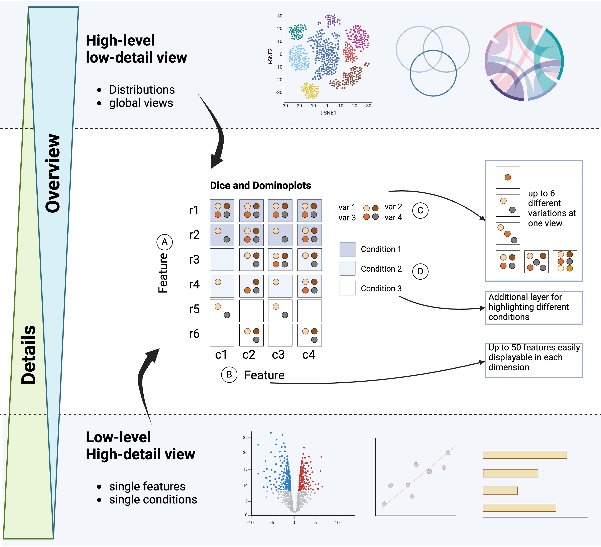

Diceplot: a package for high dimensional categorical data visualization
========================================================================

.. image:: https://www.r-pkg.org/badges/version/diceplot
    :target: https://CRAN.R-project.org/package=diceplot
    :alt: CRAN Status Badge

.. image:: https://badge.fury.io/py/pydiceplot.svg
    :target: https://pypi.org/project/pydiceplot/
    :alt: PyPI Status Badge

.. note::
   This project is under active development.

Displaying multidimensional categorical data often poses a challenge in life sciences to get a comprehensive overview of
the underlying data. This is not limited to but holds in particular for pathway analysis across multiple conditions. Here
we developed a visualization concept to create easy to understand and intuitive representation of such data. We provide
the implementation as python as well as R package to ensure easy access and application.

Features
~~~~~~~~~~~~~~~~~~~

- **Visualize Complex Data:** Easily create plots for datasets with multiple categorical variables.
- **Dice Plot:** Create dice plots for datasets with more than two categorical variables.
- **Dominoplot:** Visualize gene expression data for different cell types and contrasts.
- **R and python**: Implementations in both R and python to ensure easy access and application.
- **Customization:** Customize plots with titles, labels, and themes.
- **Integration with ggplot2:** Leverages the power of ``ggplot2`` for advanced plotting capabilities.
- **Interactive Plots:** Create interactive plots for easy exploration of your data using the plotly backend.

Diceplot
--------
You can find the `R Source Code <https://github.com/maflot/DicePlot>`_ on github.

.. toctree::
   R

pyDiceplot
--------
.. caution::

   Repository is still private

You can find the `python Source Code <https://github.com/maflot/pyDicePlot/tree/main>`_ on github.

.. toctree::
   python

Contributing
~~~~~~~~~~~~~~~~~~~

We welcome contributions from the community! If you'd like to contribute:

1. Fork the repository on GitHub.
2. Create a new branch for your feature or bug fix.
3. Submit a pull request with a detailed description of your changes.

Contact
~~~~~~~~~~~~~~~~~~~

If you have any questions, suggestions, or issues, please open an issue on GitHub.

Citation
~~~~~~~~~~~~~~~~~~~

.. note::
   Todo: preprint will soon be uploaded
